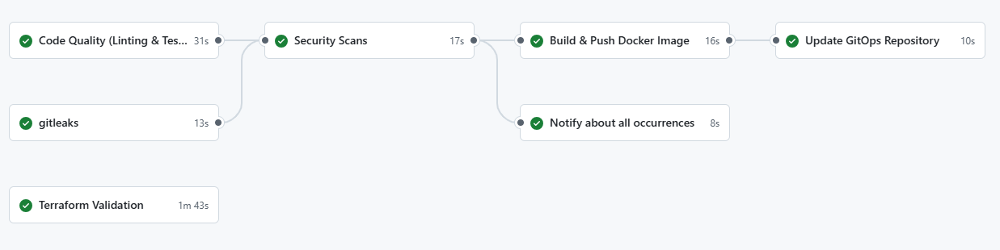

# Flask CI/CD Pipeline with GitHub Actions, AWS ECR, and ArgoCD

This project demonstrates a robust CI/CD pipeline for a Flask application using **GitHub Actions**, **AWS ECR**, and **ArgoCD**. It includes best practices for security, automation, and GitOps, making it an excellent example of modern DevOps workflows.

## Overview

The project is divided into two main parts:
1. **CI (Continuous Integration)**: Handles code quality checks, security scans, and Docker image building using GitHub Actions.
2. **CD (Continuous Deployment)**: Manages deployment to Kubernetes using ArgoCD, with AWS ECR as the container registry.

### Key Features
- **Automated Testing**: Unit tests, linting, and code formatting with `pytest`, `flake8`, and `black`.
- **Security Scans**: Dependency vulnerability checks with `safety`, static code analysis with `bandit`, IaC scan with `checkov`, and container scanning with `trivy`.
- **Docker Image Management**: Builds and pushes Docker images to AWS ECR with version tagging.
- **GitOps with ArgoCD**: Automates Kubernetes deployments using ArgoCD and a dedicated GitOps repository.
- **Logging and Monitoring**: Integrates with `Loki`, `Promtail`, and `Grafana` for centralized logging and monitoring.
- **Infrastructure as Code**: `Terraform` for AWS infrastructure provisioning and validation.

---

## Architecture



1. **GitHub Actions**:
   - Runs tests, security scans, and builds Docker images.
   - Pushes images to AWS ECR.
   - Updates the GitOps repository with the new image tag.

2. **AWS ECR**:
   - Stores Docker images securely.
   - Provides access to Kubernetes clusters for image pulling.

3. **ArgoCD**:
   - Monitors the GitOps repository for changes.
   - Deploys the Flask application to Kubernetes (Minikube in this case).

4. **Loki + Promtail + Grafana**:
   - Collects logs from the Flask application.
   - Visualizes logs and metrics in Grafana dashboards.

5. **S3**:
   - Stores Trivy reports from each CI workflow run.

6. **Python App that sends various scan reports to Loki**:
   - The CI step pushes scan reports to S3 bucket. This app fetches them from S3 and sends them to Loki.
---

## Prerequisites

### Tools
- **GitHub Actions Runner**: Self-hosted runner with Docker installed.
- **Minikube**: For local Kubernetes deployment.
- **ArgoCD CLI**: For managing ArgoCD applications.
- **AWS CLI**: For managing AWS resources (ECR, IAM, S3).
- **Terraform**: For infrastructure provisioning.

### AWS Resources
- **ECR Repository**: For storing Docker images.
- **IAM Roles**: For GitHub Actions (push to ECR) and Kubernetes (pull from ECR).
- **S3 Bucket**: For storing security scan reports and logs.

### GitOps Repository (two options)
- **Another repository for GitOps (Recommended)**: For example, a separate repository for managing Kubernetes manifests.
- **GitOps repository in the same repository**: For example, a separate `argocd` folder in the same repository. You must then create a new directory called `argocd` and clone gitops repository into it. Remember to update all references to the gitops repository in the workflow file - paths to `kubectl` commands, ArgoCD application manifests, etc.

---

## Setup Instructions

### 1. AWS Configuration
Please update all needed files according to your needs e.g. S3 bucket name, AWS Account ID etc.
#### Create IAM Users
We need IAM user for several reasons: 
- Github Actions needs have access to push image to ECR in aws  
- Kubernetes needs have access to pull image from ECR in aws  
- We need to have access to S3 bucket to store security scan reports and logs  (for this purpose we use `github-ecr-pusher`)


1. **GitHub Actions IAM User**:
   ```bash

    aws iam create-policy --policy-name S3ReadAccess --policy-document file://iam-permissions/s3-read-policy.json
    aws iam create-policy --policy-name S3WriteAccess --policy-document file://iam-permissions/s3-write-policy.json
    aws iam create-policy --policy-name ECRPushAccess --policy-document file://iam-permissions/ecr-push-policy.json
    aws iam create-user --user-name github-ecr-pusher
    aws iam attach-user-policy --user-name github-ecr-pusher --policy-arn arn:aws:iam::$(aws sts get-caller-identity --query "Account" --output text):policy/S3ReadAccess
    aws iam attach-user-policy --user-name github-ecr-pusher --policy-arn arn:aws:iam::$(aws sts get-caller-identity --query "Account" --output text):policy/S3WriteAccess
    aws iam attach-user-policy --user-name github-ecr-pusher --policy-arn arn:aws:iam::$(aws sts get-caller-identity --query "Account" --output text):policy/ECRPushAccess
    aws iam create-access-key --user-name github-ecr-pusher
   ```

2. **Kubernetes IAM User**:
   ```bash
    aws iam create-user --user-name k8s-ecr-puller
    aws iam create-policy --policy-name ECRPullOnly --policy-document file://iam-permissions/ecr-pull-policy.json
    aws iam attach-user-policy --user-name k8s-ecr-puller --policy-arn arn:aws:iam::$(aws sts get-caller-identity --query "Account" --output text):policy/ECRPullOnly
    aws iam create-access-key --user-name k8s-ecr-puller
   ```

#### Create ECR Repository
We need ECR repository to store our Flask app image.  
```bash
aws ecr create-repository --repository-name github-ci/python-flask-app --region eu-central-1
```

#### Create S3 Bucket for Logs
```bash
aws s3api create-bucket --bucket reports-from-github-action-123 --region eu-central-1 --create-bucket-configuration LocationConstraint=eu-central-1
```

### 2. GitHub Actions Setup

1. **Secrets**:
   - Add the following secrets to your GitHub repository:
     - `AWS_ACCESS_KEY_ID`
     - `AWS_SECRET_ACCESS_KEY`
     - `AWS_REGION`
     - `GITOPS_SSH_PRIVATE_KEY`

2. **Workflow**:
   - The workflow is defined in `.github/workflows/ci-cd-pipeline.yml`.
   - It includes:
     - Code quality checks (`flake8`, `black`, `pytest`).
     - Security scans (`bandit`, `safety`, `trivy`, `Checkov`).
     - Docker image build and push to ECR.
     - GitOps repository update.

### 3. ArgoCD Setup

1. **Install ArgoCD**:
   ```bash
   kubectl create namespace argocd
   helm install my-release argo/argo-cd --namespace argocd
   kubectl port-forward service/my-release-argocd-server -n argocd 8080:443
   ```

2. **Add GitOps Repository**:
   ```bash
   argocd repo add git@github.com:your-org/gitops-repo.git --ssh-private-key-path ~/.ssh/id_rsa
   ```

3. **Create ECR Secret in Kubernetes**:
   ```bash
   kubectl create secret docker-registry ecr-secret \
     --docker-server=<ECR_REGISTRY_URL> \
     --docker-username=AWS \
     --docker-password=$(aws ecr get-login-password --region <AWS_REGION>) \
     --namespace production
   ```

4. **Bootstrap ArgoCD**: 
We must create monitoring infrastructure in ArgoCD - Grafana, Prometheus, Loki. We must also create our application in ArgoCD - Flask app.

   ```bash
   git clone <gitops_repository_url>
   cd argocd
   kubectl apply -f .
   ```

---

## CI/CD Pipeline Workflow

### 1. Code Quality
- **Linting**: `flake8` and `black` ensure code style consistency.
- **Unit Tests**: `pytest` runs unit tests with coverage reporting.

### 2. Security Scans
- **Static Analysis**: `bandit` checks for security issues in Python code.
- **Dependency Check**: `safety` scans for vulnerable dependencies.
- **Container Scan**: `trivy` scans Docker images for vulnerabilities.
- **IaC Scan**: `checkov` scans terraform files for security issues.

### 3. Docker Image Build and Push
- Builds a Docker image and pushes it to AWS ECR with a unique tag.

### 4. GitOps Update
- Updates the GitOps repository with the new image tag, triggering ArgoCD to deploy the updated application.

---

## Roadmap

### Immediate Improvements
1. **Automated ECR Token Refresh**: Implement a Kubernetes CronJob to refresh ECR tokens periodically.
2. **Sealed Secrets**: Use Sealed Secrets for secure Kubernetes secret management.
3. **Monitoring Dashboard**: Build Grafana dashboards for application metrics and logs.

### Future Enhancements
1. **Multi-Cluster Deployment**: Extend ArgoCD to manage deployments across multiple Kubernetes clusters.
2. **Advanced Security**: Integrate OPA (Open Policy Agent) for policy enforcement.
3. **Cost Optimization**: Use spot instances for self-hosted GitHub Actions runners.

---

## Common Issues and Troubleshooting

### ECR Token Expiry
ECR tokens expire every 12 hours. To refresh:
```bash
kubectl delete secret ecr-secret --namespace production
kubectl create secret docker-registry ecr-secret \
  --docker-server=<ECR_REGISTRY_URL> \
  --docker-username=AWS \
  --docker-password=$(aws ecr get-login-password --region <AWS_REGION>) \
  --namespace production
```

### ArgoCD Repository Issues
Ensure the GitOps repository is correctly configured in ArgoCD:
```bash
argocd repo list
argocd app sync <APPLICATION_NAME>
```

---

## Contributing

Feel free to open issues or submit pull requests to improve this project. Contributions are welcome!

---

## License

This project is licensed under the MIT License. See the [LICENSE](LICENSE) file for details.